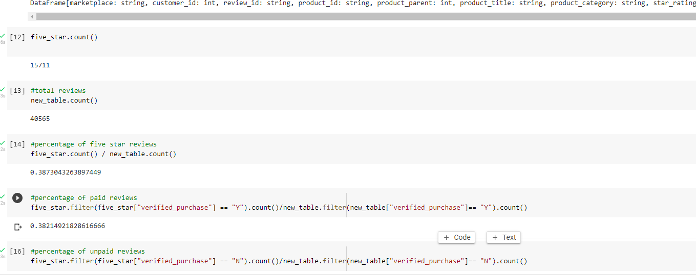

# Amazon_Vine_Analysis

## **Analysis Overview**
in this project I haved picked one of 50 datasets and use PySpark to perform the ETL process to extract the dataset, transform the data, connect to an AWS RDS instance, and load the transformed data into pgAdmin. Next, I have used PySpark, Pandas, or SQL to determine if there is any bias toward favorable reviews from Vine members in your dataset. Then, I wrote a summary of the analysis for Jennifer to submit to the SellBy stakeholders.

## **Results**
we see that we have fewer vine review than non-vine reviews and that we have 15711 five star reviews and 38.2%  of the  five start review were vine reviews.

## **Summary**

After careful analysis,There seem to be no bias .
